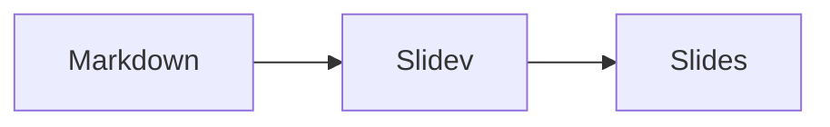

<div class="subtitle">yeeso · masterclass</div>

# Des slides en <span class="highlight">Markdown</span> avec Slidev

Écrire, animer et présenter comme on code

<!--
Bienvenue ! Pendant cette masterclass, on construit ensemble une présentation avec Slidev.

Astuce : cette présentation est elle-même écrite avec Slidev. Tout ce que vous allez voir, vous pourrez le refaire.
-->

---
layout: intro
portrait: /manon.webp
portraitAlt: Portrait de Manon Carbonnel
---

**Je suis Manon Carbonnel**

Yeeso leader à Rennes, autrice du thème Slidev aux couleurs de <span class="yeeso">Yeeso</span>.

<!--
Se présenter en deux phrases. Préciser que le thème utilisé ici est disponible sur npm : slidev-theme-yeeso.
-->

---
layout: six-cells-header
---

# Au programme

::top-left::
## 1. Découvrir
L'outil et son créateur

::top-center::
## 2. Écrire
Syntaxe, layouts, composants

::top-right::
## 3. Naviguer
La barre d'outils, bouton par bouton

::bottom-left::
## 4. Coder
Shiki, Magic Move, exécuter du code

::bottom-center::
## 5. Animer
Clics, Rough Notation, mouvements

::bottom-right::
## 6. Partager
Export PDF et mise en ligne

<!--
Six parties, environ dix minutes chacune. Les participant·es peuvent suivre sur leur machine.
-->

---
layout: section
index: "1"
---

# Découvrir Slidev

Qu'est-ce que c'est, et d'où ça vient ?

---

# Slidev, c'est quoi ?

Un outil pour créer des présentations **à partir d'un fichier Markdown**.

- Un seul fichier texte : `slides.md`
- Le rendu est une **application web** : elle s'ouvre dans le navigateur
- Pensé pour les **développeur·euses** : code, démos, versionnage avec Git

<div v-click class="mt-8">

**Slidev** = **Sli**des + **Dev**eloper

</div>

<!--
Idée clé : on se concentre sur le contenu en Markdown, la mise en forme vient du thème.

Comme c'est du texte, on peut versionner ses slides avec Git, les relire en pull request, et les réutiliser.
-->

---
layout: two-cols
---

# Qui l'a créé ?

**Anthony Fu** (<span lang="en">antfu</span>), développeur open source.

- Membre des équipes cœur de **Vue**, **Vite** et **Nuxt**
- Créateur de **VueUse**, **UnoCSS**, et mainteneur de **Shiki**
- Lance Slidev en **2021**, pour ses propres conférences

::right::

<div class="mt-20">

## Un projet open source

- Licence **MIT**, gratuit
- Code sur [GitHub : slidevjs/slidev](https://github.com/slidevjs/slidev)
- Maintenu avec une communauté de contributeur·ices
- Des dizaines de thèmes partagés sur npm

</div>

<!--
Anthony Fu voulait un outil de slides qui lui ressemble : du Markdown, du code, du Vue.

Slidev assemble ses autres projets : Vite pour le serveur, Vue pour les composants, UnoCSS pour le style, Shiki pour la coloration du code.
-->

---

# Sous le capot

Slidev assemble des briques web que vous connaissez peut-être déjà :

<div class="grid grid-cols-2 gap-x-12">
<div>

- **Vite** : serveur, rechargement instantané
- **Vue 3** : composants interactifs
- **UnoCSS** : classes utilitaires de style

</div>
<div>

- **Shiki** : coloration du code
- **Monaco** : l'éditeur de VS Code
- **KaTeX**, **Mermaid** : formules et diagrammes

</div>
</div>

<!--
Pas besoin de connaître ces outils pour commencer. Mais savoir qu'ils sont là aide à chercher de l'aide dans la bonne documentation.
-->

---

# Les fonctionnalités

- 📝 **Markdown** : le contenu d'abord, le style ensuite
- 🎨 **Thèmes** : partagés et réutilisés comme paquets npm
- 🧑‍💻 **Code** : coloration, animations, éditeur et exécution en direct
- 🤹 **Interactif** : composants Vue directement dans les slides
- 🎤 **Mode présentateur·ice** : notes, minuteur, slide suivante
- 🎥 **Enregistrement** : caméra et capture vidéo intégrées
- ✏️ **Dessin** : annoter les slides pendant la présentation
- 📤 **Export** : PDF, PNG, PPTX ou site web hébergeable

<!--
On va voir chacune de ces fonctionnalités dans la suite, avec une démo à chaque fois.
-->

---

# Démarrer un projet

Une seule commande (Node.js 20 ou plus) :

```bash
npm init slidev@latest
```

Puis dans le dossier créé :

| Commande | Effet |
| --- | --- |
| `npm run dev` | Lance la présentation sur `http://localhost:3030` |
| `npm run build` | Génère un site statique dans `dist/` |
| `npm run export` | Exporte en PDF |

<!--
La commande pose quelques questions (nom du projet, gestionnaire de paquets) puis ouvre la présentation d'exemple.

Faire la démo en direct si possible.
-->

---

# Structure d'un projet

```text
mon-projet/
├── slides.md        ← toute la présentation
├── components/      ← composants Vue, utilisables partout
├── pages/           ← slides importées depuis d'autres fichiers
├── public/          ← images, servies depuis /
├── snippets/        ← extraits de code à inclure
└── package.json
```

<div v-click>

Seul `slides.md` est **obligatoire**. Le reste est facultatif.

</div>

---
layout: section
index: "2"
---

# Écrire ses slides

La syntaxe Markdown de Slidev

---
layout: two-cols
---

# Séparer les slides

Trois tirets `---` sur une ligne créent une nouvelle slide.

```md
# Première slide

Du texte en **Markdown**.

---

# Deuxième slide

- une liste
- d'éléments
```

::right::

<div class="mt-20">

## À retenir

- Un `#` par slide : c'est son titre
- `##` pour les sous-titres
- Tout le Markdown classique fonctionne : listes, liens, tableaux, images

</div>

---
layout: two-cols
---

# Le frontmatter

Un bloc YAML **en tête de slide** la configure.

```md
---
layout: two-cols
transition: fade
---

# Ma slide
```

Le tout premier bloc, le **headmatter**, configure toute la présentation : `theme`, `title`, `transition`…

::right::

<div class="mt-20">

## Options utiles

| Clé | Effet |
| --- | --- |
| `layout` | Mise en page |
| `transition` | Animation d'entrée |
| `class` | Classes CSS |
| `hide` | Masque la slide |

</div>

<!--
Montrer le headmatter de ce fichier slides.md : theme yeeso, title, duration...
-->

---

# Les notes de présentation

Le **dernier commentaire HTML** d'une slide devient sa note.

```md
# Ma slide

Contenu visible par le public.

<!--
Note visible uniquement en mode présentateur·ice.
Le **Markdown** fonctionne aussi ici.
-->
```

Les notes s'affichent dans le **mode présentateur·ice**, qu'on verra dans la partie 3.

<!--
Voici une note ! Elle n'apparaît pas à l'écran pour le public.
-->

---
layout: two-cols
---

# Les layouts

Un layout est une **mise en page** prête à l'emploi.

```md
---
layout: two-cols
---

# Gauche

::right::

# Droite
```

Les **slots** `::right::`, `::left::`… placent le contenu dans les zones du layout.

::right::

<div class="mt-20">

## Dans le thème yeeso

- `cover`, `intro`, `section`, `end`
- `two-cols`, `three-cols-header`, `six-cells-header`
- `image-right`, `quote`, `fact`, `iframe`…

Cette slide utilise elle-même `two-cols` !

</div>

<!--
Chaque thème fournit ses layouts. La liste complète du thème yeeso est dans son README.
-->

---

# Les thèmes

Changer de thème = **une ligne** dans le headmatter.

```yaml
---
theme: yeeso      # le thème de l'association
# theme: default  # le thème par défaut
# theme: seriph   # un thème officiel
---
```

- Un thème = un paquet npm (`slidev-theme-*`), installé automatiquement
- Il apporte couleurs, polices, layouts et composants
- Galerie : [les thèmes de la communauté Slidev](https://sli.dev/resources/theme-gallery)

<!--
Ici, tout le style vient de slidev-theme-yeeso : polices Kobbi et Arimo, palette de la charte, layouts.
-->

---
layout: two-cols
---

# Les composants Vue

Un fichier `.vue` dans `components/` est **utilisable directement** :

```html
<Counter :count="10" />
```

<Counter :count="10" class="mt-4" />

::right::

<div class="mt-20">

## Composants intégrés

- `<Toc />` : sommaire automatique
- `<Youtube id="…" />` : vidéo YouTube
- `<Tweet id="…" />` : publication X
- `<Arrow />` : flèche

Aucun `import` à écrire.

</div>

<!--
Cliquer sur + et - pour montrer que le composant est vraiment interactif.
-->

---

# Formules et diagrammes

<div class="grid grid-cols-2 gap-8">
<div>

## LaTeX

```md
$\sqrt{3x-1}+(1+x)^2$
```

$\sqrt{3x-1}+(1+x)^2$

</div>
<div>

## Mermaid

````md

````


</div>
</div>

<!--
KaTeX pour les formules, Mermaid pour les schémas : tout reste du texte, donc versionnable.
-->

---
src: ./pages/imported-slides.md
hide: false
---

---
layout: section
index: "3"
---

# Naviguer

La barre d'outils, bouton par bouton

---

# Trouver la barre d'outils

Survolez le **coin en bas à gauche** de la présentation :

<NavBar class="mt-4" />

<div class="mt-8">

| Raccourci | Action |
| --- | --- |
| <kbd>espace</kbd> / <kbd>→</kbd> | Animation ou slide suivante |
| <kbd>←</kbd> | Animation ou slide précédente |
| <kbd>↑</kbd> / <kbd>↓</kbd> | Slide précédente / suivante, sans les animations |
| <kbd>g</kbd> | Aller à une slide par son numéro |

</div>

<!--
Faire survoler le coin en bas à gauche pour faire apparaître la vraie barre. On va maintenant voir chaque bouton.
-->

---

# Plein écran

<NavBar highlight="fullscreen" />

- **À quoi ça sert** : masquer l'interface du navigateur pour présenter
- **Comment** : cliquer sur le bouton, ou <kbd>F11</kbd> selon le navigateur
- **Pour sortir** : cliquer à nouveau, ou <kbd>Échap</kbd>

---

# Précédent et suivant

<NavBar highlight="next" />

- **À quoi ça sert** : avancer ou reculer d'**une étape**
- Une étape = une animation au clic, ou la slide suivante s'il n'y en a plus
- **Raccourcis** : <kbd>→</kbd> et <kbd>←</kbd>, ou <kbd>espace</kbd>
- **Astuce** : une télécommande de présentation fonctionne aussi

---

# Vue d'ensemble

<NavBar highlight="overview" />

- **À quoi ça sert** : voir toutes les slides en miniature, et sauter à l'une d'elles
- **Raccourci** : <kbd>o</kbd>, puis les flèches et <kbd>Entrée</kbd>
- **Astuce** : en local, un bouton sur chaque miniature ouvre la slide dans l'éditeur

<!--
Appuyer sur o pour la démo.
-->

---

# Mode sombre

<NavBar highlight="dark" />

- **À quoi ça sert** : basculer entre thème clair et thème sombre
- **Raccourci** : <kbd>d</kbd>
- **Forcer un mode** : `colorSchema: dark` dans le headmatter (le bouton disparaît alors)
- **Astuce** : vérifiez toujours vos slides dans **les deux** modes

<!--
Appuyer sur d pour montrer le thème yeeso en « black pearl ».
-->

---

# Caméra

<NavBar highlight="camera" />

- **À quoi ça sert** : afficher votre webcam dans une bulle, par-dessus les slides
- La bulle se **déplace** et se **redimensionne** à la souris
- **Idéal pour** : les présentations en visio et les tutoriels vidéo
- Le navigateur demande l'autorisation d'accéder à la caméra

---

# Enregistrer

<NavBar highlight="record" />

- **À quoi ça sert** : enregistrer une **vidéo** de la présentation
- Enregistre les slides **et** la caméra, en deux fichiers séparés
- La flèche à côté du bouton choisit la caméra et le micro
- **Résultat** : fichiers `.webm` téléchargés à l'arrêt

<!--
Pratique pour publier un replay de la masterclass sans logiciel externe.
-->

---

# Dessiner

<NavBar highlight="draw" />

- **À quoi ça sert** : annoter les slides en direct : stylo, flèches, formes
- Barre d'outils : couleurs, épaisseur, gomme, annuler
- **Épingler** : garde le dessin quand on change de slide
- **Garder les dessins** : `drawings: persist: true` dans le headmatter

<!--
Faire un dessin rapide sur cette slide. Avec persist: false (le cas ici), les dessins disparaissent au rechargement.
-->

---

# Mode présentateur·ice

<NavBar highlight="presenter" />

- **À quoi ça sert** : une vue **pour vous seul·e** pendant que le public voit les slides
- On y trouve : **notes**, slide suivante, **minuteur**, heure
- **Comment** : ouvrir `/presenter` dans une autre fenêtre, sur votre écran
- Les deux fenêtres restent **synchronisées**

<!--
Démo : ouvrir http://localhost:3030/presenter dans une nouvelle fenêtre et avancer. La fenêtre du public suit.
-->

---

# Éditeur intégré

<NavBar highlight="editor" />

- **À quoi ça sert** : modifier la slide **sans quitter la présentation**
- Un panneau s'ouvre sur le côté, avec le Markdown de la slide
- La slide se met à jour en direct à l'enregistrement
- **Disponible uniquement en local** (`npm run dev`), pas en ligne

---

# Exporter depuis le navigateur

<NavBar highlight="export" />

- **À quoi ça sert** : générer un **PDF** ou des **images** sans ligne de commande
- **Comment** : bouton, ou page `/export`
- Options : avec ou sans animations, notes, plage de slides
- Utilise la fonction d'impression du navigateur

<!--
L'export en ligne de commande est présenté en partie 6.
-->

---

# Informations

<NavBar highlight="info" />

- **À quoi ça sert** : afficher la **description** de la présentation
- Le contenu vient de la clé `info` du headmatter, en Markdown :

```yaml
info: |
  ## Masterclass Slidev
  Une masterclass de l'association yeeso.
```

---

# Synchronisation

<NavBar highlight="sync" />

- **À quoi ça sert** : régler la synchro entre les fenêtres ouvertes
- **Envoyer** : cette fenêtre pilote les autres
- **Recevoir** : cette fenêtre suit les autres
- **Astuce** : désactivez la réception pour naviguer seul·e sans déranger le public

---

# Réglages

<NavBar highlight="settings" />

- **Filtres d'affichage** : inverser, luminosité, contraste… pour un projecteur capricieux
- **Curseur** : pointeur classique ou **pointeur laser**
- **Échelle** : taille des slides dans la fenêtre
- **Mise en veille** : empêche l'écran de s'éteindre pendant la présentation

<!--
Le pointeur laser est particulièrement utile en mode présentateur·ice : le public voit le point rouge.
-->

---
layout: section
index: "4"
---

# Coder

Le point fort de Slidev

---
layout: two-cols
---

# Coloration avec Shiki

Un bloc de code classique suffit :

````md
```ts
const nom = 'yeeso'
console.log(`Bonjour ${nom}`)
```
````

**Shiki** colore le code comme dans VS Code, avec les mêmes thèmes.

::right::

<div class="mt-20">

## Résultat

```ts{lines: true}
const nom = 'yeeso'
console.log(`Bonjour ${nom}`)
```

## Options

- `ts [fichier.ts]` : nom de fichier
- `{lines: true}` : numéros de ligne

</div>

---

# Surligner des lignes

Ajoutez les lignes à mettre en avant entre `{ }`, séparées par `|` pour **chaque clic** :

````md
```ts {1|2-3|all}
```
````

```ts {1|2-3|all}
const association = 'yeeso'
const devise = "L'avenir de l'IT"
console.log(`${association} : ${devise}`)
```

<!--
Cliquer : ligne 1, puis lignes 2 à 3, puis tout le bloc.
-->

---

# Types au survol avec TwoSlash

Ajoutez `twoslash` : survolez le code pour voir les **types**, comme dans l'éditeur.

```ts twoslash
import { computed, ref } from 'vue'

const compteur = ref(0)
const double = computed(() => compteur.value * 2)
```

<!--
Survoler compteur et double : on voit Ref<number> et ComputedRef<number>.

Idéal pour les talks TypeScript.
-->

---

# Importer du code existant

Plutôt que copier-coller, **incluez un fichier** avec `<<<` :

```md
<<< @/snippets/external.ts#snippet
```

- `@/` désigne la racine du projet
- `#snippet` ne prend que la région `// #region snippet`

<!--
Le code reste dans un vrai fichier : il peut être testé et ne se désynchronise pas.
-->

---

# Shiki Magic Move

Animer la **transformation** d'un code, étape par étape :

````md magic-move {lines: true}
```js
// Étape 1 : une variable
const nom = 'yeeso'
```

```js
// Étape 2 : une fonction
function saluer(nom) {
  return `Bonjour ${nom}`
}
```

```js
// Étape 3 : une fonction fléchée
const saluer = nom => `Bonjour ${nom}`

console.log(saluer('yeeso'))
```
````

<!--
Cliquer pour passer d'une étape à l'autre : les morceaux communs glissent à leur nouvelle place.
-->

---

# Magic Move : la syntaxe

Enveloppez plusieurs blocs de code dans un bloc à **quatre** backticks :

`````md
````md magic-move
```js
const nom = 'yeeso'
```

```js
const saluer = nom => `Bonjour ${nom}`
```
````
`````

Chaque bloc intérieur est une étape, révélée **au clic**.

---

# Un éditeur dans la slide

Ajoutez `{monaco}` : le bloc devient un éditeur **Monaco**, celui de VS Code.

```ts {monaco}
import { ref } from 'vue'
import { emptyArray } from './external'

const tableau = ref(emptyArray(10))
```

- Autocomplétion, erreurs, survol des types
- Modifiez le code en direct devant le public

<!--
Taper quelques caractères pour montrer l'autocomplétion.
-->

---

# Exécuter du code

Avec `{monaco-run}`, le code s'**exécute** et son résultat s'affiche sous l'éditeur :

```ts {monaco-run}
import { sayHello } from './external'

sayHello()

const participantes = ['Awa', 'Léa', 'Inès']
console.log(participantes.map(p => `Bienvenue ${p} !`))
```

<!--
Modifier la liste des prénoms en direct : le résultat se met à jour tout seul.

JavaScript et TypeScript sont gérés par défaut ; on peut ajouter d'autres langages avec des « code runners ».
-->

---
layout: section
index: "5"
---

# Animer

Révéler le contenu au bon moment

---

# Apparition au clic

Ajoutez `v-click` à un élément : il apparaît au **clic suivant**.

```html
<div v-click>J'apparais au premier clic</div>
<div v-click>Et moi au deuxième</div>
```

<div v-click class="mt-4">✅ J'apparais au premier clic</div>
<div v-click>✅ Et moi au deuxième</div>

<div v-click class="mt-8">

Pour une liste entière : `<v-clicks>` révèle chaque élément un par un.

</div>

---

# Modifier l'animation

<div class="grid grid-cols-2 gap-8">
<div>

| Directive | Effet |
| --- | --- |
| `v-click.fade` | Estompe au lieu de cacher |
| `v-click.up` | Monte depuis le bas |
| `v-after` | En même temps que le précédent |
| `v-click="3"` | Au clic numéro 3 |

</div>
<div class="mt-8">

<div v-click.up>Je monte depuis le bas…</div>
<div v-after>… et j'arrive en même temps !</div>

</div>
</div>

---

# Rough Notation

`v-mark` dessine des annotations **à la main**, au clic :

```html
<span v-mark.underline>souligner</span>
<span v-mark.circle>entourer</span>
<span v-mark.box>encadrer</span>
<span v-mark.highlight>surligner</span>
```

<p class="text-2xl mt-8">
On peut
<span v-mark.underline="{ color: '#E77169' }">souligner</span>,
<span v-mark.circle="{ color: '#60D1A4' }">entourer</span>,
<span v-mark.box="{ color: '#E77169' }">encadrer</span>
ou <span v-mark.highlight="{ color: '#EFABFF' }">surligner</span>.
</p>

<!--
Quatre clics, une annotation à chaque fois. La couleur se passe en option : v-mark="{ color: '#E77169' }".

Propulsé par la bibliothèque Rough Notation.
-->

---
layout: two-cols
---

# Mouvements

`v-motion` anime la **position**, la **taille**, l'**opacité** :

```html
<div
  v-motion
  :initial="{ x: -200, opacity: 0 }"
  :enter="{ x: 0, opacity: 1 }"
>
  Slidev
</div>
```

- `initial` : l'état de départ
- `enter` : l'état à l'arrivée sur la slide
- `click-1`, `click-2`… : un état par clic

::right::

<div class="mt-32 text-center">
  <div
    v-motion
    :initial="{ x: -200, opacity: 0 }"
    :enter="{ x: 0, opacity: 1, transition: { delay: 400, duration: 800 } }"
    :click-1="{ scale: 1.5 }"
    class="text-5xl font-bold"
  >
    Slidev
  </div>
</div>

<!--
Le mot arrive depuis la gauche, puis grossit au clic.
-->

---

# Transitions entre slides

Dans le frontmatter, `transition` choisit l'animation d'**entrée** de la slide :

```yaml
---
transition: slide-left
---
```

| Valeur | Effet |
| --- | --- |
| `fade` | Fondu |
| `slide-left` / `slide-right` | Glisse horizontalement |
| `slide-up` / `slide-down` | Glisse verticalement |
| `view-transition` | Fait « voyager » les éléments communs |

<!--
Placée dans le headmatter, la transition s'applique à toutes les slides.
-->

---
layout: section
index: "6"
---

# Partager

Diffuser sa présentation

---

# Exporter en ligne de commande

```bash
npm run export                           # PDF
npx slidev export --format png           # une image par slide
npx slidev export --format pptx          # PowerPoint
npx slidev export --with-clicks          # une page par animation
```

<div v-click class="mt-6">

La première fois, installez le navigateur utilisé pour l'export :

```bash
npm i -D playwright-chromium
```

</div>

<!--
Le PDF est pratique à envoyer, mais peu accessible aux lecteurs d'écran : partagez aussi la version web quand c'est possible.
-->

---

# Mettre en ligne

`npm run build` génère un **site statique** dans `dist/`, hébergeable partout.

- **Vercel** : un fichier `vercel.json` (déjà dans ce projet) et le tour est joué
- **Netlify**, **GitHub Pages** : même principe, on publie `dist/`
- Le public garde toutes les fonctionnalités : navigation, vue d'ensemble, code

<div v-click class="mt-6">

Option `download: true` dans le headmatter : ajoute un bouton **Télécharger en PDF** au site.

</div>

---

# Récapitulatif

<div class="grid grid-cols-2 gap-8">
<div>

| Je veux… | J'utilise… |
| --- | --- |
| Une nouvelle slide | `---` |
| Une mise en page | `layout: two-cols` |
| Des notes | `<!-- note -->` |
| Présenter | `/presenter` |

</div>
<div>

| Je veux… | J'utilise… |
| --- | --- |
| Surligner du code | `{1\|2-3}` |
| Animer du code | `md magic-move` |
| Exécuter du code | `{monaco-run}` |
| Faire apparaître | `v-click` |
| Annoter | `v-mark.circle` |

</div>
</div>

---
layout: end
---

**Des questions ?**

- [Documentation de Slidev](https://sli.dev)
- [Code source de Slidev](https://github.com/slidevjs/slidev)
- [Thème yeeso pour Slidev](https://github.com/Yeeso-fr/slidev-theme-yeeso)

<!--
Proposer aux participant·es de créer leur première présentation avec npm init slidev@latest et le thème yeeso.
-->
